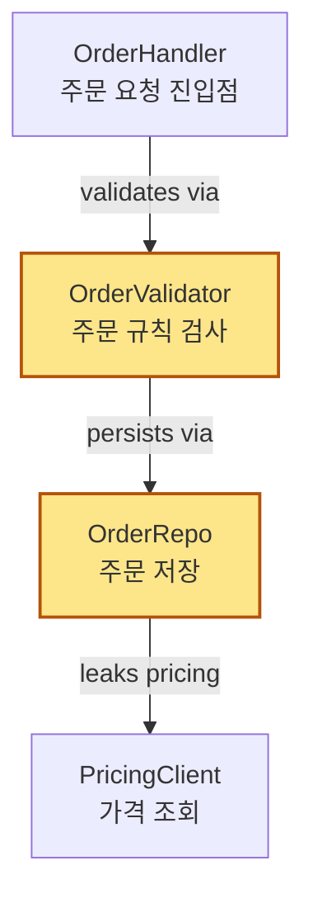
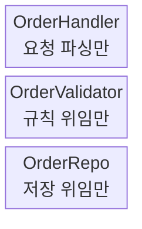
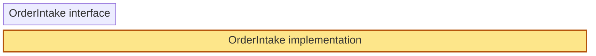
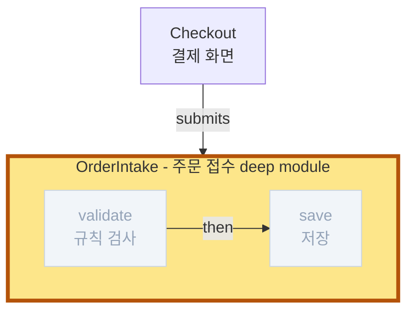

# org 리포트 형식

아키텍처 리뷰는 `~/architecture-review/YYYY-MM-DD-HHMM-<repo>.org` 하나로 렌더한다(`<repo>` = 저장소 디렉터리 이름). 디렉터리가 없으면 만든다. 다이어그램은 전부 org mermaid 블록이고, 렌더는 온디맨드 - 사용자가 `C-c C-c`/export로 PNG를 만든다(pre-render하지 않는다).

## 스캐폴드(Scaffold)

```org
#+title: Architecture review - <repo>
#+startup: overview

- 날짜: YYYY-MM-DD / 범위: <탐색 범위 한 줄>
- 범례: 하이라이트 = deepening 대상 module, 흐린 노드 = deep module 내부가 된 호출, ?=추정   ← ?=추정은 추정 엣지가 있을 때만

* Top recommendation

  - [[*<후보 헤딩 텍스트>]] - <이유 한 문장>

* 후보

** <deepening 이름>                                      :strong:in_process:

   - Problem: <한 문장. 무엇이 아픈가>
   - Solution: <한 문장. 무엇이 바뀌는가>
   - Files:
     - /abs/path/foo.ts:1
     - /abs/path/bar.ts:1

*** Before

    - <caption 한 줄>
    #+begin_src mermaid :file ~/architecture-review/<base>-<slug>-before.png :width "2048"
    <mermaid 소스>
    #+end_src

*** After

    - <caption 한 줄>
    #+begin_src mermaid :file ~/architecture-review/<base>-<slug>-after.png :width "2048"
    <mermaid 소스>
    #+end_src

*** Wins

    - locality: <...>
    - leverage: <...>

*** ADR                                                  ← ADR과 충돌할 때만

    - ADR-<NNNN>과 모순되지만, <...> 때문에 재검토할 가치가 있음
```

- `<base>` = org 파일 이름(확장자 제외), `<slug>` = 후보 제목 kebab. PNG가 후보·before/after마다 고유해야 한다.
- 도입 문단은 없다. 곧바로 Top recommendation, 그다음 후보로 들어간다.

## 후보 헤딩(Candidate heading)

다이어그램이 무게를 진다. 산문은 드물고, 평이하며, `codebase-design` glossary 용어를 쓴다.

- **제목**: 짧게, deepening을 이름 짓는다(예: "Order intake module 접기").
- **태그**: recommendation strength 하나 + 의존성 분류 하나. 아래 고정 집합에서만 고른다(sparse tree `C-c / m`로 필터용).
  - strength: `strong` / `worth_exploring` / `speculative`
  - 의존성: `in_process` / `local_substitutable` / `ports_adapters` / `mock`
- **Problem / Solution**: 각각 한 문장.
- **Files**: 절대경로:라인 bullet.
- **Before / After**: 중심축. 같은 패턴, 같은 노드 Id를 유지해 두 블록을 위아래로 비교할 수 있게 한다.
- **Wins**: bullet, 각 한 줄 짧게.
- **ADR**: 해당 시만, 한 줄.

설명 문단은 없다. 다이어그램을 이해하는 데 문단이 필요하다면, 다이어그램을 다시 그려라.

## 다이어그램 패턴(Diagram patterns)

후보에 맞는 패턴을 고른다. 섞는다. 모든 다이어그램이 똑같아 보이게 하지 마라. 다양성이 핵심의 일부다.

flowchart/sequence/class의 노드 라벨(식별자`<br/>`역할), 엣지 라벨(관계 동사), 추정 표시(`?` 접두), 노드 상한(~15), `class` 한 줄 하나 규칙은 [explain-change](../explain-change/SKILL.md) §4를 그대로 따른다. `block`은 라벨 규칙만 적용한다.

이 리포트 전용 확장은 둘뿐이다. 모든 다이어그램에서 같은 정의를 쓴다.

```
classDef changed fill:#fde68a,stroke:#b45309,stroke-width:2px
classDef internal fill:#f1f5f9,color:#94a3b8,stroke:#cbd5e1
```

- `changed` = deepening 대상 module. before/after 양쪽에 칠한다. after의 deep module은 `stroke-width:4px`로 두껍게.
- `internal` = deep module 안으로 들어가 이제 내부가 된 호출.
- leakage는 엣지 동사로(`leaks pricing`), seam은 `subgraph` 라벨로(`seam: <이름>`). 선 모양·`linkStyle`로 의미를 얹지 않는다.
- `subgraph` 라벨은 한 줄 - `<br/>`를 넣으면 내부 노드와 겹친다.

### 의존성 / 콜 플로우 (`flowchart TD`, 주력)

요점이 "X가 Y를 부르고 Y가 Z를 부르는데, 이 난장판을 봐라"일 때.



### 왕복 횟수 (`sequenceDiagram`)

"before: 6번 왕복, after: 1번"을 보여줄 때. before/after의 메시지 수 대비가 요점이다.

### 단면도(Cross-section) (`block`, 계층적 얕음에 좋음)

호출이 통과하는 계층을 `columns 1`로 세로로 쌓는다. Before: 각자 아무것도 안 하는 얇은 계층 N개. After: 통합된 책임으로 라벨된 블록 1개(`changed`, 두꺼운 테두리).



### 질량 다이어그램(Mass diagram) (`block`, "interface가 implementation만큼 넓음"에 좋음)

module당 2행: interface 블록과 implementation 블록. 폭은 `id:N` 열 span으로 상대 비율만 보여준다(측정값이 아니다). Before: 두 폭이 비슷하다(shallow). After: interface는 좁고 implementation은 넓다(deep). 라벨이 블록 최소 폭을 정하므로 라벨은 짧게.



### 콜 그래프 붕괴(Call-graph collapse) (`flowchart TD` + `subgraph`)

Before: 함수 호출 트리를 평범한 flowchart로. After: 같은 트리를 deep module `subgraph` 하나로 감싸고, 이제 내부가 된 호출은 `internal`로 흐리게.



## org 표기

[walkthrough](../walkthrough/SKILL.md)의 "org 표기" 규칙을 따른다. 요지:

- 코드 위치는 `/abs/path/foo.ts:42`(절대경로 + 단일 라인), verbatim으로 감싸지 않는다.
- 한 항목 = 한 bullet = 물리적으로 한 줄.
- 식별자는 `=...=`, 바로 뒤에 한글 조사를 붙이지 않는다.
- 헤딩 아래 본문은 별 개수 + 1칸 들여쓴다.

## Top recommendation 섹션

후보 헤딩으로 가는 내부 링크, 이유 한 문장. 그게 전부다.

## 톤(Tone)

한국어 평이한 문장, 간결하게. 단, 아키텍처 명사와 동사는 `codebase-design` 스킬에서 곧장 오고, 영어 원형 그대로 쓴다. 간결함이 표류의 핑계는 아니다.

**정확히 이것만 쓴다:** module, interface, implementation, depth, deep, shallow, seam, adapter, leverage, locality.

**절대 바꿔 쓰지 않는다:** component, service, unit (module 대신) · API, signature (interface 대신) · boundary (seam 대신) · layer, wrapper (module을 뜻할 때).

**이 스타일에 맞는 표현:**

- "Order intake module이 shallow - interface가 implementation과 거의 같음"
- "Pricing이 seam을 넘어 leak"
- "Deepen: interface 하나, 테스트할 곳 하나"
- "adapter 둘이 seam을 정당화 - 프로덕션은 HTTP, 테스트는 in-memory"

**Wins bullet**은 이득을 glossary 용어로 이름 짓는다: *"locality: 버그가 module 하나에 모임"*, *"leverage: interface 하나, 호출부 N곳"*, *"interface 축소, implementation이 얇은 module들을 흡수"*. *"유지보수가 쉬워짐"*이나 *"코드가 깔끔해짐"*이라고 쓰지 마라. glossary에 없는 말이고 제 몫을 하지 못한다.

얼버무림 없이, 목청 가다듬기 없이, "참고로…" 없이. 문장이 bullet이 될 수 있으면 bullet으로 만들어라. bullet을 잘라낼 수 있으면 잘라내라. 어떤 용어가 `codebase-design` glossary에 없다면, 새 용어를 지어내기 전에 있는 용어로 손을 뻗어라.
